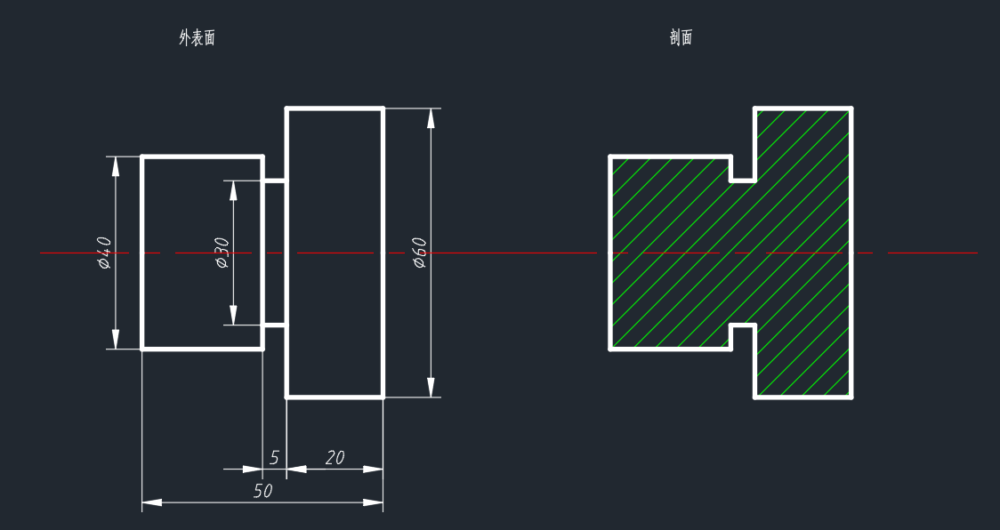

# example

样例一

包含节点：轴肩、退刀槽


dxf版本：2018 dxf

jsonc生成器如下。

* 注1：这里的生成器并不完整，缺乏节点类型、节点尺寸、节点端口等信息，需要进一步补充。为了避免被覆盖，暂时使用example1_plus.jsonc 作为完整文件，后续版本的生成器将会包含这些信息，与 `*_plus.jsonc` 相同
* 注2：这里使用了绝对路径，需要时应当采用相对路径。这是由于懒得改py路径，所以代码文件在 scripts 文件夹下的 example.py
* 注3：要求py3，包含 json库、os库
* 注4：单文件输出的jsonc文件层数过多，不便于查看和阅读，强烈建议使用多文件输出。文件结构为将子节点放在子文件夹下面

```python
"""
file: example.py
auther: yixing
"""
from base_assembly import Assembly
from base_component import Component

if __name__ == "__main__":
    # 创建回转轴装配线节点
    rotary_axis = Assembly("ex1_rotary_axis", "just a axis")
    # 添加第一个轴肩，此时一右边第一个作为初始轴肩
    rotary_axis.add_node(
        "_fixed",
        "null",
        Component("ex1_shoulder_1", "first shoulder"),
    )
    # 创建第二个轴肩节点
    shoulder_2 = Component("ex1_shoulder_2", "second shoulder")
    # 创建第二个轴肩的外表面装配线，并添加在第二个轴肩上
    sh2_external = Assembly(
        "ex1_sh2_external",
        "Outer surface of shaft shoulder 2",
    )
    # 在第二个轴肩的外表面装配线上添加退刀槽
    sh2_external.add_node(
        "_contain",
        ["_left", "ex1_shoulder_1"],  # 退刀槽在第一个轴肩左侧
        Component("groove", "tool withdrawal groove"),
    )
    # 将轴肩外表面装配线添加到第二个轴肩上
    shoulder_2.add_node(sh2_external)
    # 将第二个轴肩添加到回转轴装配线上
    rotary_axis.add_node(
        "_fixed",
        ["_left", "ex1_shoulder_1"],
        shoulder_2,
    )
    # 以下两种输出方式二选一
    # 单文件输出
    rotary_axis.output_to_json(
        "F:\\yixing_sub\\doing\\code\\YHMD-project\\YHMD-language-standards\\Examples\\example1\\jsonc\\example1.jsonc"
    )
    # 多文件输出
    rotary_axis.output_to_jsons(
        "F:\\yixing_sub\\doing\\code\\YHMD-project\\YHMD-language-standards\\Examples\\example1\\jsonc"
    )
```
